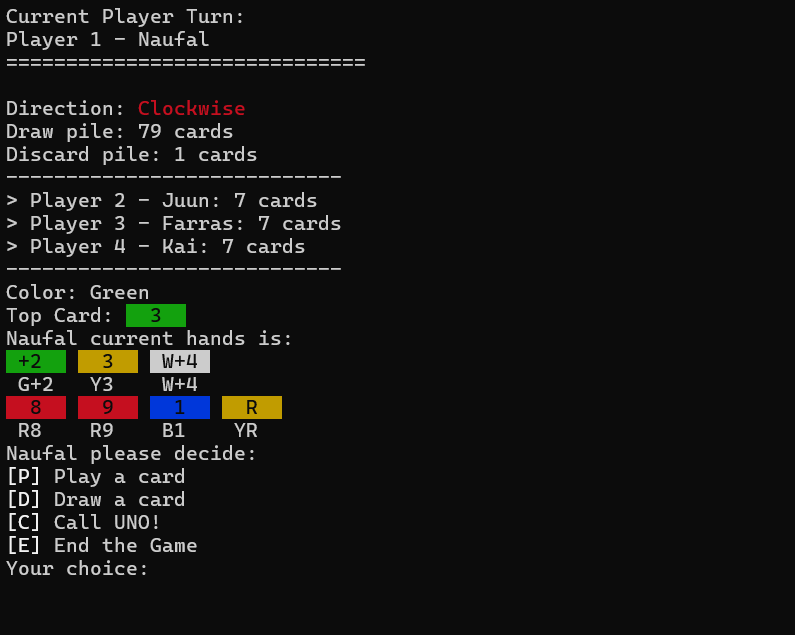
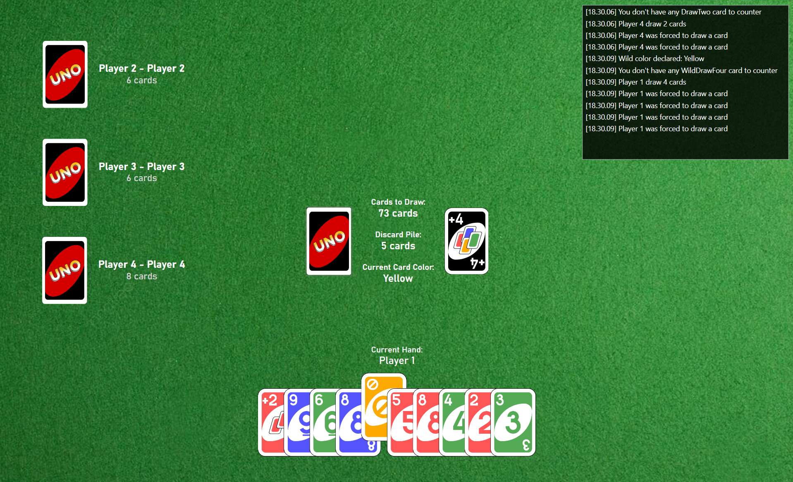

# 🎴 Uno Game (C#)

A full-featured Uno card game built with **C#** — available in both **Console** and **WPF** versions.  
Developed as part of a learning journey exploring .NET application architecture, game logic, and UI integration.

---

## 🧩 Project Overview

This project is a digital recreation of the popular **Uno** card game.  
It implements the complete set of Uno rules — including **Draw Two**, **Reverse**, **Skip**, **Wild**, and **Wild Draw Four** cards — with turn logic, color management, and player state handling.

There are multiple application layers:
- 🧠 **BackEnd** → Core game logic and models (the heart of the Uno engine)
- 💻 **ConsoleApp / ConsoleUI** → Play Uno directly in the terminal
- 🪟 **WPFApp** → Graphical version with a clean and simple UI
- 🧱 **UnoGame.sln** → Visual Studio solution for managing all sub-projects

---

## 🚀 Features

- Fully implemented Uno rules  
- Modular game architecture (separate logic, UI, and backend layers)  
- Console-based version for quick testing and gameplay  
- WPF version with GUI interface  

---

## 🗂️ Folder Structure
```
UnoGame/
├── UnoGame.BackEnd/ # Core game logic and data structures
├── UnoGame.ConsoleApp/ # Entry point for console-based game
├── UnoGame.ConsoleUI/ # Handles user interaction in console
├── UnoGame.WPFApp/ # Graphical interface version (WPF)
└── UnoGame.sln # Visual Studio solution file
```

---

## ⚙️ How to Build & Run

### 🧱 Console Version
You can run the console version directly via the .NET CLI:

```bash
cd UnoGame.ConsoleApp
dotnet run
```

### 🪟 WPF Version
You can open the solution in Visual Studio and set UnoGame.WPFApp as the startup project,
then run the project normally (F5 or Run button).

---

## 📸 Preview



---

## 🧰 Built With

- C# (.NET)
- WPF (Windows Presentation Foundation)
- .NET 8.0
- Object-Oriented Design Principles

---

## 👤 Author

Developed by [Muhammad Naufal Farras](https://www.linkedin.com/in/muhnaufalfarras/ "Muhammad Naufal Farras").

For support or questions, feel free to reach out via [LinkedIn](https://www.linkedin.com/in/muhnaufalfarras/) or open an issue on this repository.
> Feel free to fork, explore, and contribute!